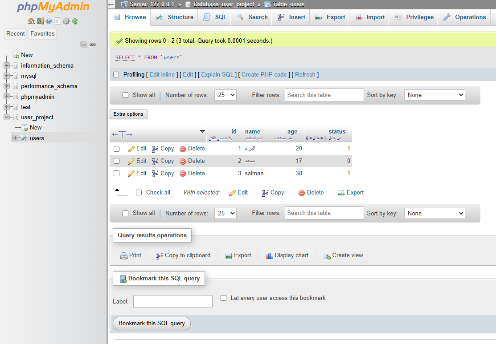
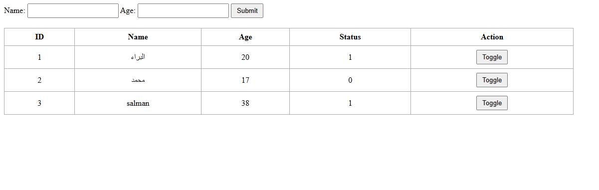

# 🧑‍💻 Simple User Management System

A simple web-based user management project using PHP, MySQL, HTML, and CSS.

## 📄 Description
A simple web-based user management project using PHP and MySQL. It allows users to submit name and age, stores the data in a database, and displays it in a table with a toggle button to switch status (0 or 1) instantly on the page without reload.

## 🧰 Built With
- PHP
- MySQL
- HTML/CSS

## 🖼️ Screenshots
  

## 📁 File Structure
- `index.php` – Main form and data table  
- `config.php` – Database connection  
- `update_status.php` – Handles status toggle  
- `style.css` – Optional styling  
- `images/` – Folder containing screenshots

## ⚙️ How to Run
1. Copy project files into `htdocs` directory of XAMPP.
2. Create a MySQL database and table as defined in `config.php`.
3. Start Apache and MySQL via XAMPP Control Panel.
4. Open browser and go to: `http://localhost/your-folder/index.php`

## 🤝 Contact
For questions or improvements, feel free to reach out.
